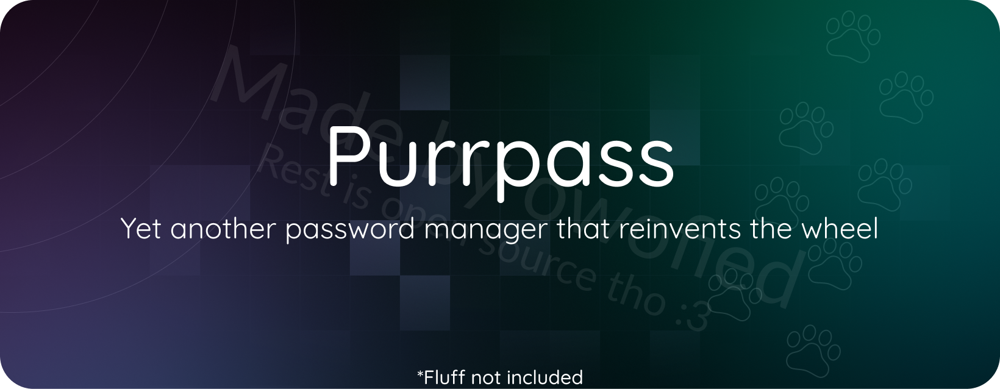

<a name="readme-top"></a>

[![Contributors][contributors-shield]][contributors-url]
[![Forks][forks-shield]][forks-url]
[![Stargazers][stars-shield]][stars-url]
[![Issues][issues-shield]][issues-url]
[![MIT License][license-shield]][license-url]

<!-- PROJECT LOGO -->
<br />
<div align="center">
  <a href="https://github.com/owofied/purrpass">
    
  </a>
  <p align="center">
    <br />
    <a href="https://github.com/owofied/purrpass"><strong>Explore the docs »</strong></a>
    <br />
    <a href="https://github.com/owofied/purrpass/issues">Report Bug</a>
    ·
    <a href="https://github.com/owofied/purrpass/issues">Request Feature</a>
  </p>
</div>

<!-- ABOUT THE PROJECT -->
## About The Project

PurrPass is a free and open-source self-hosted password manager designed to simplify and secure your digital life while giving you full control over your data. In an age where online security is more critical than ever, PurrPass provides a reliable and user-friendly solution to manage your passwords, ensuring your valuable data remains private and accessible only to you.

<p align="right">(<a href="#readme-top">back to top</a>)</p>

## Motivation

The motivation behind PurrPass is to provide accessible, transparent, and user-controlled online security. PurrPass aims to make your online experience safe and stress-free, giving you confidence to navigate the digital world without fear of data breaches or password problems.

<p align="right">(<a href="#readme-top">back to top</a>)</p>

<!-- GETTING STARTED -->
## Getting Started

This section will guide you through the process of configuring, building, and running PurrPass.

### Building & Running

If you want to build and run the project locally, run the following commands:

```shell
git clone https://github.com/owofied/PurrPass.git
cd PurrPass
cargo build --release
./target/release/purrpass
# Or without the --release flag for unoptimized build
cargo build
./target/debug/purrpass
```

<p align="right">(<a href="#readme-top">back to top</a>)</p>

## Why reinvent the wheel?

You may be wondering why PurrPass exists when other password managers are available. PurrPass was created to provide:

**1. Self-hosting control:** You have complete control over your data security and privacy by self-hosting.

**2. Open Source Transparency:** The source code is open for review, building trust and allowing community contributions.

**3. User-Centered Design:** PurrPass user-friendly interface is designed for ease of use.

**4. Password Security:** Strong encryption ensures that your data remains secure.

**5. Data Backup and Accessibility:** Backup and synchronization options keep your data safe and accessible.

<p align="right">(<a href="#readme-top">back to top</a>)</p>


<!-- LICENSE -->
## License

Distributed under the GNU General Public License v3.0. See `LICENSE` for more information.

<p align="right">(<a href="#readme-top">back to top</a>)</p>

<!-- MARKDOWN LINKS & IMAGES -->
<!-- https://www.markdownguide.org/basic-syntax/#reference-style-links -->
[contributors-shield]: https://img.shields.io/github/contributors/owofied/purrpass.svg?style=for-the-badge
[contributors-url]: https://github.com/owofied/purrpass/graphs/contributors
[forks-shield]: https://img.shields.io/github/forks/owofied/purrpass.svg?style=for-the-badge
[forks-url]: https://github.com/owofied/purrpass/network/members
[stars-shield]: https://img.shields.io/github/stars/owofied/purrpass.svg?style=for-the-badge
[stars-url]: https://github.com/owofied/purrpass/stargazers
[issues-shield]: https://img.shields.io/github/issues/owofied/purrpass.svg?style=for-the-badge
[issues-url]: https://github.com/owofied/purrpass/issues
[license-shield]: https://img.shields.io/github/license/owofied/purrpass.svg?style=for-the-badge
[license-url]: https://github.com/owofied/purrpass/blob/master/LICENSE.txt
